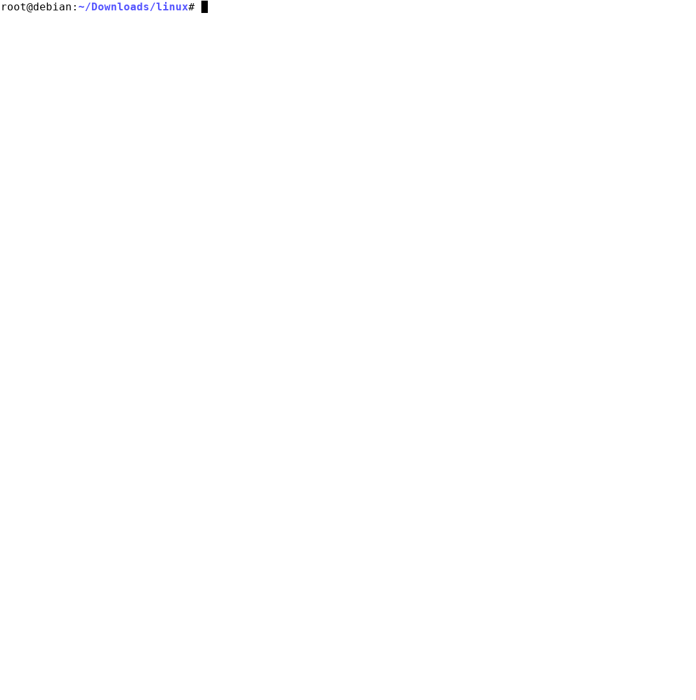

========================
Navigating Kernel Source
========================

Collect compiled source precisely, usage::

   # Latest kernel

      make ...
      make COMPILED_SOURCE=1 [KBUILD_ABS_SRCTREE=1] compile_commands.json cscope

   # Common, kernel or uboot

      make ...                                  # build the kernel
      [KBUILD_ABS_SRCTREE=1] ./tags.sh          # generate cscope.files in pwd

      make O=dir/ ...                           # build the kernel
      [KBUILD_ABS_SRCTREE=1] ./tags.sh dir/     # generate cscope.files in dir/

   # Output files

      GEN     cscope
      GEN     compile_commands.json

         cscope.files                           # Source Insight, Scitools Understand, SlickEdit
         cscope.in.out
         cscope.out                             # vi
         cscope.po.out

         compile_commands.json                  # clangd, language server protocol

`linux.git <https://github.com/torvalds/linux.git>`__
::

   commit 162343a876f14f7604881dd2bc53ca140c82c230
   Author: Rustam Kovhaev <rkovhaev@gmail.com>
   Date:   Mon Aug 10 08:36:50 2020 -0700

       scripts/tags.sh: exclude tools directory from tags generation

       when COMPILED_SOURCE is set, running 'make ARCH=x86_64 COMPILED_SOURCE=1
       cscope tags' in KBUILD_OUTPUT directory produces lots of "No such file
       or directory" warnings:
       ...
       realpath: sigchain.h: No such file or directory
       realpath: orc_gen.c: No such file or directory
       realpath: objtool.c: No such file or directory
       ...
       let's exclude tools directory from tags generation

       Fixes: 4f491bb6ea2a ("scripts/tags.sh: collect compiled source precisely")
       Link: https://lore.kernel.org/lkml/20200809210056.GA1344537@thinkpad
       Signed-off-by: Rustam Kovhaev <rkovhaev@gmail.com>
       Link: https://lore.kernel.org/r/20200810153650.1822316-1-rkovhaev@gmail.com
       Signed-off-by: Greg Kroah-Hartman <gregkh@linuxfoundation.org>

   commit 4f491bb6ea2aef2f5b184f385904a73796d98554
   Author: Jialu Xu <xujialu@vimux.org>
   Date:   Thu Aug 6 23:17:29 2020 -0700

       scripts/tags.sh: collect compiled source precisely

       Parse compiled source from *.cmd but don't 'find' too many files that are
       not related to compilation.

       [xujialu@vimux.org: don't expand symlinks by add option -s for realpath]
         Link: http://lkml.kernel.org/r/5efc5bfb.1c69fb81.41bf5.7131SMTPIN_ADDED_MISSING@mx.google.com

       Signed-off-by: Jialu Xu <xujialu@vimux.org>
       Signed-off-by: Andrew Morton <akpm@linux-foundation.org>
       Cc: Greg Kroah-Hartman <gregkh@linuxfoundation.org>
       Cc: Masahiro Yamada <masahiroy@kernel.org>
       Cc: Mauro Carvalho Chehab <mchehab+huawei@kernel.org>
       Cc: Jonathan Corbet <corbet@lwn.net>
       Cc: Joe Perches <joe@perches.com>
       Link: http://lkml.kernel.org/r/5ee5d8e3.1c69fb81.9b804.47b2SMTPIN_ADDED_MISSING@mx.google.com
       Signed-off-by: Linus Torvalds <torvalds@linux-foundation.org>
